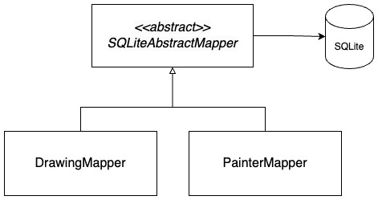
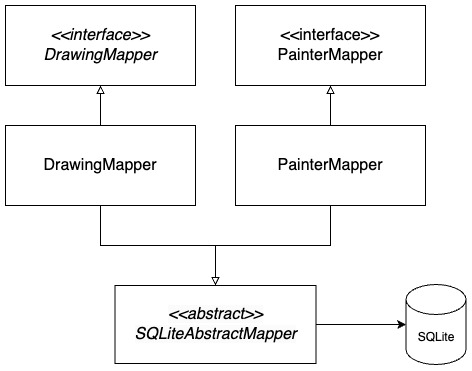

# POSD with C++ (and more)

#### FALL, 2023

#### Prof Y C Cheng

#### Dept of Computer Science and Information Engineering

#### Taipei Tech

## Lab 2

### Test time: 2023/12/21 18:00 ~ 21:00

### Allowed materials

- Textbook: Design Patterns Elements of Reusable Object-Oriented Software.
- Lab GitLab: http://140.124.181.100
- Dictionary: https://dictionary.cambridge.org/zht/
- CPlusPlus.com: https://cplusplus.com
- CppReference: https://cppreference.com
- GoogleTest User Guide: https://google.github.io/googletest/
- course link: http://140.124.181.100/yccheng/posd2023f
- jenkins link: http://140.124.181.97:8080

### Notice

* **DO NOT add any .c or .cpp file in your program that is not provided or required by the assignment**
* **Your point will not be taken for memory leak in this lab test**
* Please use the given makefile. You can modify the makefile if needed, but do not remove "all", "dirs", and "clean". Also, "all" must depend on "dirs". If you have any further questions about makefile, please search and learn it manually.
* Do not change the code structure, function prototype, or interface of the provided code, otherwise, your code might not be compilable with TA's test.
* Do not commit the object files and executable files to git, otherwise, your code might not be executable on the Jenkins server.
* The unit test you wrote will be also graded, please write the unit test comprehensively for the code you wrote.
* The design of your program will also be graded, please follow the required patterns precisely while writing your program.

### Environment Setting

Before start the test, please open the terminal and install sqlite 3 with the following commands:

```shell
sudo apt-get update
sudo apt-get install sqlite3
sudo apt-get install libsqlite3-dev
```

Password (1222): lab1222
Password (1223): ubuntu

### Problem

In this lab test, you are going to work on the code from the [given code](./given_code). Note that the given code is the answer to assignment 5, but slightly adjusted for the lab test.

#### Extract interfaces from the two mappers

You have implemented `DrawingMapper` and `PainterMapper` to persist the domain objects `Drawing` and `Painter` to the database. In this lab test, you will have to extract interfaces from both mappers, in the manner of _Dependency Inversion Principle_.

The following class diagram shows the current class relationship of the mappers:



Please extract `DrawingMapper` and `PainterMapper` as interfaces and rename the current concrete classes as `SQLiteDrawingMapper` and `SQLitePaintingMapper`, respectively.

**HINT: an interface in C++ is a class with all the member functions being [pure virtual](https://cplusplus.com/doc/tutorial/polymorphism#abstract_base_classes).**
**HINT: you will use [multiple inheritance](https://cplusplus.com/doc/tutorial/inheritance/#multiple_inheritance) for your concrete class.**
**HINT: to avoid multiple inheritance issues, DO NOT remove the implementation of the method `cleanCache()` defined in `SQLitePainterMapper`.**

The following class diagram shows the refactored class relationship:



The interfaces `DrawingMapper` and `PainterMapper` should contain **all the public member functions defined in the concrete classes**. In addition, to make the new design compatible with the existing code, both **mapper interfaces should provide static methods `instance()`**, which invoke the _Singleton_ method `instance()` of their concrete classes, respectively.  
For example, `static DrawingMapper* DrawingMapper::instance()` should return the singleton instance of `SQLiteDrawingMapper` by invoking the method `static SQLiteDrawingMapper* SQLiteDrawingMapper::instance()`.

Each of the four mapper classes should be compiled as an object file. The four classes should be placed as the following descriptions:

- `DrawingMapper` should be defined in `src/drawing_mapper.h` and `src/drawing_mapper.cpp` and will be compiled as `obj/drawing_mapper.o`.
  
- `PainterMapper` should be defined in `src/painter_mapper.h` and `src/painter_mapper.cpp` and will be compiled as `obj/painter_mapper.o`.

- `SQLiteDrawingMapper` should be defined in `src/sqlite_drawing_mapper.h` and `src/sqlite_drawing_mapper.cpp` and will be compiled as `obj/sqlite_drawing_mapper.o`.

- `SQLitePainterMapper` should be defined in `src/sqlite_painter_mapper.h` and `src/sqlite_painter_mapper.cpp` and will be compiled as `obj/sqlite_painter_mapper.o`.

**HINT: remember to update the makefile**

#### Add an in-memory implementation for mappers

To avoid relying on an external database during the testing stage, you will implement an in-memory version for both mappers. That is, you will provide another implementation for the mapper interfaces that store the domain objects with a C++ container (such as std::list, std::vector, std::array, std::map, etc.), instead of connecting to a database.

The two in-memory mappers are named `InMemoryDrawingMapper` and `InMemoryPainterMapper` and derive from `DrawingMapper` and `PainterMapper`, respectively.

In addition, the two in-memory mappers should also provide a static method `instance()` to implement the _Singleton_ pattern.

Both in-memory mappers should be compiled as object files. These two classes should be placed as the following descriptions:

- `InMemoryDrawingMapper` should be defined in `src/inmemory_drawing_mapper.h` and `src/inmemory_drawing_mapper.cpp` and will be compiled as `obj/inmemory_drawing_mapper.o`.
  
- `InMemoryPainterMapper` should be defined in `src/inmemory_painter_mapper.h` and `src/inmemory_painter_mapper.cpp` and will be compiled as `obj/inmemory_painter_mapper.o`.

**HINT: remember to update the makefile**
**HINT: for in-memory mappers, you DO NOT need to deep copy the result while finding a domain object, you can simply return the pointer to the same instance stored in the mapper.**

#### Control mapper implementation with Singleton

You will modify `DrawingMapper::instance()` and `PainterMapper::instance()` to control whether to use SQLite or in-memory implementation during runtime. 

To do this, please use the _Singleton_ object `DbMode`, provided in the given code, located in `src/db_mode.h`. The client should be able to control the used mapper by setting db mode with the method `DbMode::setMode`.

If `DbMode` is set to `SQLite`, which is the default setting, `DrawingMapper::instance()` and `PainterMapper::instance()` should return the singleton object of `SQLiteDrawingMapper` and `SQLitePainterMapper`, respectively.

On the other hand, if `DbMode` is set to `InMemory`, `DrawingMapper::instance()` and `PainterMapper::instance()` should return the singleton object of `InMemoryDrawingMapper` and `InMemoryPainterMapper`, respectively.

### Score

* Design by students: 90%
* Passing Unit tests written by TA: 10%